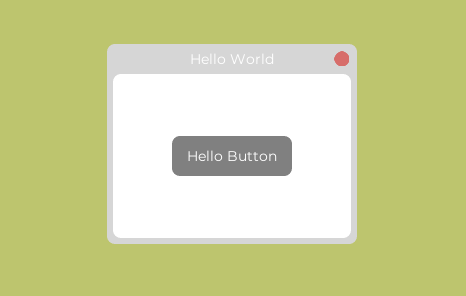

# uFrame
an experimental and programmatic approach to make floating and dragging windows in unity based on uGUI.
```csharp
private void Start() 
{
    var window = new Window();
    window.SetTitle("Hello World");
    window.SetSize(200, 100);
}

```
